# AI Rate Lock Agents - Autonomous Mortgage Processing System

## Project Purpose

This project implements a multi-agent AI system designed to automate the mortgage rate lock process, reducing manual intervention and accelerating loan processing workflows. The system handles approximately **1,000 rate lock requests per week**, automatically progressing requests through their lifecycle and identifying cases that require human attention.

---

## Problem Statement

Traditional mortgage rate lock processing involves multiple manual steps where requests often get stuck waiting for human analysis and intervention. This creates bottlenecks in the loan origination process and delays closing timelines for borrowers.

**Specific Challenges:**
- Manual email review and data extraction
- Loan eligibility validation requires human judgment
- Rate quote generation involves multiple system lookups
- Compliance checks are time-consuming and error-prone
- Confirmation document creation is manual and inconsistent
- Limited audit trail for regulatory requirements

---

## Solution Overview

The AI Rate Lock Agents system uses **Semantic Kernel (SK)** and **Azure OpenAI GPT-4o** to create autonomous agents that monitor rate lock requests and automatically progress them through completion. Each agent has specialized responsibilities and works collaboratively to move requests forward.

### ⚡ Core Innovation: Autonomous LLM Function Calling

Unlike traditional automation systems with hardcoded business logic, this system leverages **Semantic Kernel's automatic function calling** architecture:

1. **Agents are thin LLM wrappers** (~50-100 lines) that define WHAT to accomplish via system prompts
2. **LLMs autonomously decide** which plugin functions to call based on context (via `FunctionChoiceBehavior.Auto()`)
3. **Plugins contain ALL business logic** (database operations, API integrations, messaging)

**Example Architecture:**
```python
# Agent (50 lines) - Just defines role and available tools
class EmailIntakeAgent(BaseAgent):
    def _get_system_prompt(self) -> str:
        return """You are the Email Intake Agent.
        
        AVAILABLE TOOLS:
        - CosmosDB.create_rate_lock(...) - Create rate lock record
        - ServiceBus.send_workflow_event(...) - Notify next agent
        
        YOUR TASK: Parse email, create record, notify Loan Context Agent.
        Use tools autonomously to complete your task!
        """

# LLM autonomously calls plugins - NO explicit calls in agent code!
# Plugins registered with kernel for autonomous invocation
```

**Key Architectural Principles:**
- ❌ **NEVER** call plugins explicitly in agent code
- ✅ **ALWAYS** let LLM autonomously invoke plugins via Semantic Kernel
- ✅ Agents define prompts; LLMs decide which functions to call
- ✅ All business logic lives in plugins, not agents

---

## System Architecture

### Multi-Agent Design

The system consists of **seven specialized agents** that replicate the normal human-led process, each powered by Azure OpenAI GPT-4o for intelligent decision-making:

```mermaid
graph TB
    subgraph "Inbound Processing"
        Email[📧 Email Received<br/>Logic Apps]
        InboundQueue[🔷 inbound-email-queue]
    end
    
    subgraph "AI Agent Orchestrator"
        EmailIntake[🤖 Email Intake Agent<br/>Parse & Validate]
        LoanContext[🤖 Loan Context Agent<br/>Eligibility Check]
        RateQuote[🤖 Rate Quote Agent<br/>Generate Options]
        Compliance[🤖 Compliance Risk Agent<br/>Risk Assessment]
        LockConfirm[🤖 Lock Confirmation Agent<br/>Execute Lock]
        Audit[🤖 Audit Logging Agent<br/>Track All Actions]
        Exception[🤖 Exception Handler Agent<br/>Error Escalation]
    end
    
    subgraph "Service Bus Coordination"
        Topic[📢 loan-lifecycle-events<br/>Topic with Filters]
    end
    
    subgraph "Storage & AI"
        CosmosDB[(🗄️ Cosmos DB<br/>Loan State)]
        OpenAI[🧠 Azure OpenAI<br/>GPT-4o + Semantic Kernel]
    end
    
    subgraph "Outbound Processing"
        OutboundQueue[🔷 outbound-email-queue]
        Notification[📧 Email Sent<br/>Logic Apps]
    end
    
    Email --> InboundQueue
    InboundQueue --> EmailIntake
    EmailIntake --> Topic
    Topic -->|email_parsed| LoanContext
    Topic -->|context_retrieved| RateQuote
    Topic -->|rate_quoted| Compliance
    Topic -->|compliance_passed| LockConfirm
    Topic -->|ALL messages| Audit
    Topic -->|high priority| Exception
    LockConfirm --> OutboundQueue
    OutboundQueue --> Notification
    
    EmailIntake -.->|LLM Function Calling| OpenAI
    LoanContext -.->|LLM Function Calling| OpenAI
    RateQuote -.->|LLM Function Calling| OpenAI
    Compliance -.->|LLM Function Calling| OpenAI
    LockConfirm -.->|LLM Function Calling| OpenAI
    
    EmailIntake -.->|Read/Write State| CosmosDB
    LoanContext -.->|Read/Write State| CosmosDB
    RateQuote -.->|Read/Write State| CosmosDB
    Compliance -.->|Read/Write State| CosmosDB
    LockConfirm -.->|Read/Write State| CosmosDB
    Audit -.->|Write Logs| CosmosDB
    
    style Email fill:#4FC3F7,stroke:#0277BD,stroke-width:3px,color:#000
    style InboundQueue fill:#FFB74D,stroke:#E65100,stroke-width:3px,color:#000
    style EmailIntake fill:#81C784,stroke:#2E7D32,stroke-width:3px,color:#000
    style LoanContext fill:#81C784,stroke:#2E7D32,stroke-width:3px,color:#000
    style RateQuote fill:#81C784,stroke:#2E7D32,stroke-width:3px,color:#000
    style Compliance fill:#81C784,stroke:#2E7D32,stroke-width:3px,color:#000
    style LockConfirm fill:#81C784,stroke:#2E7D32,stroke-width:3px,color:#000
    style Audit fill:#FFD54F,stroke:#F57F17,stroke-width:3px,color:#000
    style Exception fill:#FF8A65,stroke:#D84315,stroke-width:3px,color:#000
    style Topic fill:#FFB74D,stroke:#E65100,stroke-width:3px,color:#000
    style OutboundQueue fill:#FFB74D,stroke:#E65100,stroke-width:3px,color:#000
    style Notification fill:#4FC3F7,stroke:#0277BD,stroke-width:3px,color:#000
    style OpenAI fill:#BA68C8,stroke:#6A1B9A,stroke-width:3px,color:#000
    style CosmosDB fill:#4DB6AC,stroke:#00695C,stroke-width:3px,color:#000
```



---

## 📧 **Email Intake Agent** (`EmailIntakeAgent`)

**Primary Role**: First point of contact for rate lock requests via email

**Key Responsibilities**:
- **Inbox Monitoring**: Receives messages from `inbound-email-queue` (Azure Logic Apps integration)
- **Email Parsing**: Uses GPT-4o to extract structured data from unstructured email content
- **Data Extraction**: LLM autonomously identifies and captures:
  - Borrower name and contact information
  - Loan application ID references
  - Property address details
  - Requested lock terms and preferences
- **Identity Validation**: Verifies sender email matches known borrower records
- **Record Creation**: Autonomously calls `CosmosDB.create_rate_lock()` plugin function
- **Workflow Initiation**: Autonomously calls `ServiceBus.send_workflow_event()` to notify next agent

**Intelligence Model**: 
- Uses Azure OpenAI GPT-4o for natural language understanding
- Semantic analysis to handle varying email formats and language
- NO regex or hardcoded parsing - pure LLM intelligence

**Behavioral Patterns**:
- Event-driven activation (NO polling - async Service Bus receiver)
- LLM autonomously decides which plugin functions to invoke
- Escalates suspicious or unverifiable requests via Exception Handler
- Creates initial `PendingRequest` status loan lock records

**Trigger**: `inbound-email-queue` from Azure Logic Apps  
**Publishes To**: `loan-lifecycle-events` topic with `MessageType: 'email_parsed'`

---

## 🏦 **Loan Application Context Agent** (`LoanApplicationContextAgent`)

**Primary Role**: Loan origination system integration and validation

**Key Responsibilities**:
- **LOS Integration**: Autonomously calls `LOS.fetch_loan_data()` plugin to connect with Loan Origination Systems
- **Data Retrieval**: LLM-guided retrieval of comprehensive loan application data:
  - Borrower financial information and credit details
  - Property information and appraisal status
  - Loan terms, amount, and product type
  - Current processing status and milestones
- **Eligibility Validation**: GPT-4o analyzes eligibility based on:
  - Loan processing stage (pre-approved, underwritten, etc.)
  - Required documentation completion status
  - Income and asset verification status
  - Credit approval and conditions
- **Context Enrichment**: Autonomously calls `CosmosDB.update_rate_lock()` to enrich loan context

**Intelligence Model**:
- GPT-4o reasoning for eligibility determination (NOT hardcoded rules)
- Understands complex loan scenarios and edge cases
- Makes nuanced decisions about blocking conditions

**Behavioral Patterns**:
- LLM validates borrower identity by cross-referencing email with loan records
- Autonomously checks for blocking conditions using available plugin functions
- Re-queries LOS for fresh data via plugin calls
- Transitions loan locks from `PendingRequest` to `UnderReview` upon successful validation

**Trigger**: Subscription filter `MessageType = 'email_parsed'`  
**Publishes To**: `loan-lifecycle-events` topic with `MessageType: 'context_retrieved'`

---

## 💰 **Rate Quote Agent** (`RateQuoteAgent`)

**Primary Role**: Pricing engine integration and rate option generation

**Key Responsibilities**:
- **Pricing Engine Integration**: Autonomously calls `PricingEngine.get_rates()` plugin (Optimal Blue, MCT Trading, Polly)
- **Rate Option Generation**: GPT-4o generates multiple strategic rate lock options with varying:
  - Interest rates and points combinations
  - Lock term durations (30, 45, 60+ days)
  - Product variations and special programs
- **Financial Calculations**: LLM performs intelligent calculations for monthly payments, APRs, and total loan costs
- **Timeline Optimization**: GPT-4o recommends optimal lock terms based on estimated closing dates
- **Special Programs**: LLM identifies applicable options like:
  - Float-down capabilities for rate improvements
  - Lock-and-shop programs for purchase transactions
  - Extended lock terms for complex scenarios

**Intelligence Model**:
- GPT-4o analyzes market conditions and loan characteristics
- Strategic thinking about rate vs. points trade-offs
- Considers borrower's financial situation and timeline

**Behavioral Patterns**:
- LLM autonomously calls pricing plugins to fetch current rates
- Refreshes rate quotes by re-invoking plugins when needed (market volatility)
- Considers LTV ratios, credit scores, and loan characteristics for accurate pricing
- Provides tiered options from conservative to aggressive pricing strategies
- Transitions loan locks from `UnderReview` to `RateOptionsPresented`

**Trigger**: Subscription filter `MessageType = 'context_retrieved'`  
**Publishes To**: `loan-lifecycle-events` topic with `MessageType: 'rate_quoted'`

---

## ⚖️ **Compliance & Risk Agent** (`ComplianceRiskAgent`)

**Primary Role**: Regulatory compliance and risk management

**Key Responsibilities**:
- **Regulatory Compliance**: GPT-4o ensures adherence to:
  - TRID (Truth in Lending/Real Estate Settlement) requirements
  - State-specific lending regulations
  - Federal lending guidelines and consumer protection laws
- **Disclosure Management**: LLM autonomously validates presence and timeliness of:
  - Initial Loan Estimates
  - Rate Lock Disclosure forms
  - Truth in Lending statements
  - Good Faith Estimates
- **Risk Assessment**: GPT-4o evaluates:
  - Lock timing against closing schedules
  - Fee reasonableness and competitive positioning
  - Borrower capacity and debt-to-income ratios
  - Property and collateral adequacy
- **Exception Identification**: LLM autonomously flags issues requiring human review

**Intelligence Model**:
- GPT-4o understands complex regulatory requirements
- Reasoning about risk factors and compliance implications
- Nuanced judgment on PASS/WARN/FAIL determinations

**Behavioral Patterns**:
- LLM performs comprehensive validation before allowing rate lock execution
- Autonomously generates detailed compliance reports using plugin functions
- Auto-generates missing disclosures when possible via `DocumentGeneration.create_disclosure()`
- Escalates FAIL status items to exception handling via autonomous plugin calls
- Allows WARNING status items to proceed with notation

**Trigger**: Subscription filter `MessageType = 'rate_quoted'`  
**Publishes To**: `loan-lifecycle-events` topic with `MessageType: 'compliance_passed'`

---

## 🔒 **Lock Confirmation Agent** (`LockConfirmationAgent`)

**Primary Role**: Rate lock execution and confirmation management

**Key Responsibilities**:
- **Lock Execution**: Autonomously calls `PricingEngine.execute_lock()` to submit confirmed rate to pricing engines
- **System Updates**: LLM orchestrates updates by calling multiple plugins:
  - `LOS.update_loan_system()` - Update Loan Origination Systems
  - `CosmosDB.update_rate_lock()` - Update internal tracking
  - `PricingEngine.register_lock()` - Update pricing engine registries
- **Document Generation**: GPT-4o creates professional rate lock confirmation documents via `DocumentGeneration.create_confirmation()`
- **Stakeholder Communication**: Autonomously sends confirmations to:
  - Borrowers with rate protection details
  - Loan officers with processing instructions
  - Operations teams with timeline requirements
- **Status Management**: Transitions loan locks to final `Locked` status

**Intelligence Model**:
- GPT-4o generates personalized, professional confirmation documents
- Understands stakeholder communication needs
- Makes intelligent decisions about notification routing

**Behavioral Patterns**:
- LLM validates all prerequisite approvals before execution
- Autonomously creates immutable lock records with expiration tracking
- Implements retry logic for system integration failures (via plugin error handling)
- Maintains detailed confirmation audit trails
- Sets up automatic expiration monitoring and alerts

**Trigger**: Subscription filter `MessageType = 'compliance_passed'`  
**Publishes To**: `outbound-email-queue` for Logic Apps to send confirmations

---

## 📋 **Audit & Logging Agent** (`AuditLoggingAgent`)

**Primary Role**: Compliance documentation and performance monitoring

**Key Responsibilities**:
- **Comprehensive Logging**: Autonomously records all system activities via `CosmosDB.create_audit_log()`:
  - Individual agent actions and outcomes
  - State transitions with timestamps
  - Error events and resolution attempts
  - Compliance check results and findings
- **Audit Trail Generation**: Creates complete chronological records for:
  - Regulatory compliance audits
  - Internal quality assurance reviews
  - Performance analysis and optimization
- **SLA Monitoring**: GPT-4o tracks key performance indicators:
  - Processing time by state and overall
  - Agent performance and success rates
  - Exception frequency and resolution times
- **Reporting**: LLM generates detailed reports for management and compliance teams

**Intelligence Model**:
- GPT-4o analyzes patterns and generates insights from audit data
- Identifies anomalies and trends automatically
- Creates human-readable compliance reports

**Behavioral Patterns**:
- Operates continuously alongside all other agents
- Receives ALL messages via `MessageType IS NOT NULL` subscription filter
- Implements secure, tamper-proof logging via autonomous plugin calls
- Provides real-time dashboards and alerting
- Archives historical data for trend analysis
- Enables drill-down investigation of specific cases

**Trigger**: Subscription filter `MessageType IS NOT NULL` (receives ALL workflow events)  
**Publishes To**: Cosmos DB `AuditLogs` container

---

## 🚨 **Exception Handler Agent** (`ExceptionHandlerAgent`)

**Primary Role**: Human escalation and complex case management

**Key Responsibilities**:
- **Exception Classification**: GPT-4o categorizes issues by:
  - Priority level (High, Medium, Low)
  - Complexity requirements (Standard, Complex, Specialist-required)
  - Business impact (Blocking vs. Non-blocking)
- **Intelligent Routing**: LLM directs cases to appropriate staff:
  - Loan officers for standard borrower issues
  - Compliance specialists for regulatory matters
  - Pricing specialists for rate anomalies
  - Technical support for system problems
- **Escalation Management**: Autonomously coordinates human intervention through:
  - Email notifications via `Email.send_alert()` plugin
  - SMS alerts for high-priority cases via `SMS.send_alert()`
  - Slack/Teams integration via `Notifications.send_to_channel()`
- **Resolution Tracking**: Monitors escalated cases until completion

**Intelligence Model**:
- GPT-4o understands exception context and severity
- Makes intelligent routing decisions based on issue type
- Learns patterns to suggest process improvements

**Behavioral Patterns**:
- Automatically triggers on predefined exception conditions
- LLM provides comprehensive context and recommended actions to human reviewers
- Implements escalation hierarchies (loan officer → supervisor → specialist)
- Tracks resolution times against SLA targets
- Learns from escalation patterns to improve automatic processing

**Trigger**: Subscription filter `Priority = 'high' OR MessageType = 'exception'`  
**Publishes To**: `high-priority-exceptions` queue for manual intervention

---

## 🔄 Agent Interaction Patterns

### Sequential Processing

Agents typically operate in sequence:

```
1. EmailIntakeAgent 
   ↓
2. LoanApplicationContextAgent 
   ↓
3. RateQuoteAgent 
   ↓
4. ComplianceRiskAgent 
   ↓
5. LockConfirmationAgent
```

### Parallel Support

`AuditLoggingAgent` and `ExceptionHandlerAgent` operate continuously alongside primary agents

### Shared State Architecture

All agents read/write to shared loan lock state in **Azure Cosmos DB**, enabling coordination without direct coupling

### Error Recovery

Any agent can autonomously invoke `ExceptionHandlerAgent` when encountering unresolvable issues by publishing exception events

### Autonomous Function Calling Flow


**Key Principle**: Agents define WHAT to do (via system prompts), and GPT-4o autonomously decides HOW (by calling plugin functions). No hardcoded logic!

---

## Rate Lock Lifecycle States

The system manages rate locks through the following states:


### State Descriptions

| State | Description | Agent Responsible |
|-------|-------------|-------------------|
| **PendingRequest** | Email received, awaiting processing | Email Intake Agent |
| **UnderReview** | Loan and borrower eligibility being validated | Loan Context Agent |
| **RateOptionsPresented** | Lock options presented to borrower | Rate Quote Agent |
| **Locked** | Lock confirmed and executed | Lock Confirmation Agent |
| **Expired** | Lock expired before use | System (automated) |
| **Cancelled** | Lock cancelled at any stage | Human/System |

---

## Data Model

The system uses a comprehensive JSON entity structure to represent loan locks at different stages. As a rate lock request progresses through the system, different agents populate and update the fields of this entity.

### Core Entity Fields

- **loanLockId**: Unique identifier for the rate lock
- **loanApplicationId**: Reference to the loan application
- **borrower**: Contact and identification information
- **property**: Property details and occupancy type
- **lockDetails**: Rate, terms, expiration, and lock metadata
- **compliance**: Regulatory checks and fee information
- **audit**: Action history and agent attribution
- **notifications**: Communication tracking

### Field Population by State

Different fields are populated as the rate lock progresses through its lifecycle, enabling agents to understand what actions are needed at each stage.

---

### State 1: `PendingRequest`

This is the initial state when a request is first created by the `EmailIntakeAgent`. It contains only the essential information extracted from the initial email.

```json
{
  "status": "PendingRequest",
  "loanApplicationId": "LA-20251005-04567",
  "borrower": {
    "name": "Jane Doe",
    "email": "jane.doe@example.com"
  },
  "lockDetails": {
    "status": "PendingRequest"
  },
  "audit": {
    "createdBy": "agent:EmailIntakeAgent",
    "createdAt": "2025-10-05T14:00:00Z"
  }
}
```

**Populated Fields**: `borrower`, `loanApplicationId`, `status`, `audit`  
**Empty Fields**: `rate`, `lockDate`, `lockExpirationDate`, `compliance`, `notifications`

---

### State 2: `UnderReview`

After the `LoanApplicationContextAgent` has verified the loan and borrower details against the Loan Origination System (LOS), the status is updated to `UnderReview`.

```json
{
  "status": "UnderReview",
  "loanApplicationId": "LA-20251005-04567",
  "borrower": {
    "name": "Jane Doe",
    "email": "jane.doe@example.com"
  },
  "lockDetails": {
    "status": "UnderReview",
    "loanAmount": 450000,
    "loanType": "Conventional"
  },
  "audit": {
    "createdBy": "agent:EmailIntakeAgent",
    "lastUpdatedBy": "agent:LoanApplicationContextAgent"
  }
}
```

**Populated Fields**: `loanAmount`, `loanType`, `status`, `audit`  
**Empty Fields**: `rate`, `lockDate`, `lockExpirationDate`, `compliance`, `notifications`

---

### State 3: `RateOptionsPresented`

The `RateQuoteAgent` fetches available rate options from the pricing engine and presents them.

```json
{
  "status": "RateOptionsPresented",
  "lockDetails": {
    "status": "RateOptionsPresented",
    "rateOptions": [
      { "termDays": 30, "rate": 6.25 },
      { "termDays": 45, "rate": 6.375 }
    ],
    "lockSource": "Optimal Blue"
  },
  "audit": {
    "lastUpdatedBy": "agent:RateQuoteAgent"
  }
}
```

**Populated Fields**: `rateOptions`, `lockSource`  
**Empty Fields**: `lockDate`, `lockExpirationDate`, `compliance`, `notifications`

---

### State 4: `Locked`

This is the final, successful state after the `LockConfirmationAgent` has executed the lock. All fields are now populated.

```json
{
  "loanLockId": "LL-20251005-00123",
  "loanApplicationId": "LA-20251005-04567",
  "borrower": {
    "name": "Jane Doe",
    "email": "jane.doe@example.com",
    "phone": "+1-555-123-4567"
  },
  "property": {
    "address": "123 Main St, Morristown, NJ 07960",
    "type": "Single Family",
    "occupancy": "Primary Residence"
  },
  "lockDetails": {
    "status": "Locked",
    "lockDate": "2025-10-05T14:30:00Z",
    "lockExpirationDate": "2025-11-04T23:59:59Z",
    "lockTermDays": 30,
    "rate": 6.25,
    "loanAmount": 450000,
    "loanType": "Conventional",
    "loanPurpose": "Purchase",
    "rateType": "Fixed",
    "floatDownOption": false,
    "lockSource": "Optimal Blue",
    "lockedBy": "agent:LockConfirmationAgent"
  },
  "compliance": {
    "disclosuresSent": true,
    "lockFee": 250.00,
    "lockFeeWaived": false,
    "regulatoryChecksPassed": true,
    "exceptions": []
  },
  "audit": {
    "createdBy": "agent:EmailIntakeAgent",
    "createdAt": "2025-10-05T14:31:00Z",
    "lastUpdatedBy": "agent:ComplianceRiskAgent",
    "lastUpdatedAt": "2025-10-05T14:45:00Z"
  },
  "notifications": {
    "borrowerNotified": true,
    "loanOfficerNotified": true,
    "notificationMethod": ["email"]
  }
}
```

**All fields are populated.**

---

### Terminal States: `Expired` and `Cancelled`

If a lock is not confirmed in time or is withdrawn, it moves to a terminal state.

**Expired**:
```json
{
  "status": "Expired",
  "lockDetails": {
    "status": "Expired",
    "lockDate": "2025-09-05T10:00:00Z",
    "lockExpirationDate": "2025-10-05T23:59:59Z",
    "rate": 6.25
  },
  "audit": {
    "lastUpdatedBy": "agent:AuditAgent"
  }
}
```

**Cancelled**:
```json
{
  "status": "Cancelled",
  "lockDetails": {
    "status": "Cancelled",
    "cancelReason": "Borrower switched to ARM product"
  },
  "audit": {
    "lastUpdatedBy": "agent:ExceptionHandlerAgent"
  }
}
```

---

## Agent Communication Model

### Shared State Architecture

All agents operate on a shared loan lock entity stored in **Azure Cosmos DB**. This eliminates the need for complex inter-agent messaging while maintaining state consistency.

**Benefits:**
- Simple coordination without direct coupling
- Single source of truth for loan state
- Optimistic concurrency control prevents conflicts
- Complete audit trail via Cosmos DB change feed

---

### Event-Driven Coordination

**Azure Service Bus** triggers agent actions based on state changes:

| Message Type | Description | Target Agent |
|--------------|-------------|--------------|
| `email_received` | New email from Logic Apps | Email Intake Agent |
| `email_parsed` | Email data extracted | Loan Context Agent |
| `context_retrieved` | Loan eligibility validated | Rate Quote Agent |
| `rate_quoted` | Rate options generated | Compliance Risk Agent |
| `compliance_passed` | Compliance checks passed | Lock Confirmation Agent |
| `exception_occurred` | Error requiring escalation | Exception Handler Agent |

---

### Coordination Patterns

#### Primary Processing Flow

```
EmailIntake → LoanContext → RateQuote → Compliance → LockConfirmation
```

Each agent publishes to `loan-lifecycle-events` topic with appropriate `MessageType`, and Service Bus subscription filters route messages to the correct next agent.

#### Continuous Support Agents

- **AuditLoggingAgent**: Logs every agent action and state transition (receives ALL messages)
- **ExceptionHandlerAgent**: Monitors for failure conditions and escalates as needed (receives exceptions and high-priority messages)

#### Retry and Recovery

- Failed agent actions trigger automatic retries with exponential backoff (handled in BaseAgent)
- After retry exhaustion, ExceptionHandlerAgent creates human escalation cases
- State rollback capabilities for critical failures

#### Parallel Processing

- Multiple loan locks can be processed simultaneously
- Agents use optimistic locking to prevent concurrent modification conflicts
- Queue-based load balancing distributes work across agent instances

---

### Data Flow Architecture


---

### Agent Communication Flow

```mermaid
%%{init: {'theme':'base', 'themeVariables': { 'primaryColor':'#81C784','primaryTextColor':'#000','primaryBorderColor':'#2E7D32','lineColor':'#1565C0','secondaryColor':'#FFB74D','tertiaryColor':'#CE93D8','noteBkgColor':'#FFF9C4','noteBorderColor':'#F9A825','actorBkg':'#4FC3F7','actorBorder':'#0277BD','actorTextColor':'#000','signalColor':'#1565C0','signalTextColor':'#000','labelBoxBkgColor':'#FFD54F','labelBoxBorderColor':'#F57F17'}}}%%
sequenceDiagram
    participant Email as 📧 Inbound Email
    participant InQ as 🔷 inbound-email-queue
    participant Intake as 🤖 Email Intake Agent
    participant Topic as 📢 loan-lifecycle-events
    participant Context as 🤖 Loan Context Agent
    participant Quote as 🤖 Rate Quote Agent
    participant Comp as 🤖 Compliance Agent
    participant Lock as 🤖 Lock Confirmation Agent
    participant Audit as 🤖 Audit Agent
    participant Exception as 🤖 Exception Handler
    participant OutQ as 🔷 outbound-email-queue
    participant Notify as 📧 Outbound Email
    participant DB as 🗄️ Cosmos DB
    participant AI as 🧠 GPT-4o
    
    Note over Email,Notify: Primary Workflow (Sequential Processing)
    
    rect rgb(200, 230, 255)
    Email->>InQ: New rate lock request
    InQ->>Intake: Message received
    Intake->>AI: Parse email (LLM)
    AI-->>Intake: Extracted data
    Intake->>DB: Create RateLockRecord
    Intake->>Topic: Publish (MessageType='email_parsed')
    Topic->>Audit: ALL messages
    end
    
    rect rgb(200, 255, 230)
    Topic->>Context: Filter: email_parsed
    Context->>AI: Validate eligibility (LLM)
    AI-->>Context: Eligibility decision
    Context->>DB: Update state → UnderReview
    Context->>Topic: Publish (MessageType='context_retrieved')
    Topic->>Audit: ALL messages
    end
    
    rect rgb(255, 245, 200)
    Topic->>Quote: Filter: context_retrieved
    Quote->>AI: Generate rate options (LLM)
    AI-->>Quote: Rate quotes
    Quote->>DB: Update state → RateOptionsPresented
    Quote->>Topic: Publish (MessageType='rate_quoted')
    Topic->>Audit: ALL messages
    end
    
    rect rgb(230, 200, 255)
    Topic->>Comp: Filter: rate_quoted
    Comp->>AI: Assess compliance (LLM)
    AI-->>Comp: Risk assessment
    Comp->>DB: Update compliance status
    Comp->>Topic: Publish (MessageType='compliance_passed')
    Topic->>Audit: ALL messages
    end
    
    rect rgb(200, 255, 255)
    Topic->>Lock: Filter: compliance_passed
    Lock->>AI: Execute lock (LLM)
    AI-->>Lock: Lock confirmation
    Lock->>DB: Update state → Locked
    Lock->>OutQ: Send confirmation email
    OutQ->>Notify: Email sent
    end
    
    Note over Exception,Topic: Exception Flow (Error Handling)
    
    alt Exception Occurs
        rect rgb(255, 220, 200)
        Intake--xException: Priority='high'
        Exception->>AI: Analyze exception (LLM)
        AI-->>Exception: Escalation decision
        Exception->>DB: Log exception
        Exception->>OutQ: Alert notification
        end
    end
    
    Note over Audit,Topic: Audit Flow (Parallel Logging)
    
    rect rgb(255, 255, 200)
    Audit->>DB: Log all agent actions
    Audit->>DB: Maintain audit trail
    end
```



#### Message Flow Details

**Primary Workflow (Sequential Processing)**:

1. 📧 Email → `inbound-email-queue` → Email Intake Agent
2. Email Intake Agent → `loan-lifecycle-events` topic → Loan Context Agent
3. Loan Context Agent → `loan-lifecycle-events` topic → Rate Quote Agent
4. Rate Quote Agent → `loan-lifecycle-events` topic → Compliance Risk Agent
5. Compliance Risk Agent → `loan-lifecycle-events` topic → Lock Confirmation Agent
6. Lock Confirmation Agent → `outbound-email-queue` → 📧 Outbound Email

**Audit Flow (Parallel Logging)**:

- All agents publish events to `loan-lifecycle-events` topic
- Audit Logging Agent subscribes with filter `MessageType IS NOT NULL` (receives ALL messages)
- Maintains complete audit trail of all agent actions and state transitions

**Exception Flow (Error Handling)**:

- All agents can publish to `loan-lifecycle-events` topic with `Priority = 'high'`
- Exception Handler Agent processes exceptions and creates human alerts
- Critical exceptions trigger immediate notifications

**Topic Architecture**:

- **1 Primary Topic**: `loan-lifecycle-events` - Main workflow coordination
- **3 Queues**: Point-to-point messaging
  - `inbound-email-queue` - Email intake processing
  - `outbound-email-queue` - Email confirmations and notifications
  - `high-priority-exceptions` - Critical human intervention required
- **Subscriptions**: Each agent has dedicated subscriptions with SQL message filtering
- **Dead Letter Queues**: Automatic handling of failed message processing

---

## Technology Stack

### Core Technologies

| Component | Technology | Purpose |
|-----------|-----------|---------|
| **AI Orchestration** | Semantic Kernel 1.0+ | Agent framework and autonomous function calling |
| **LLM Engine** | Azure OpenAI GPT-4o | Natural language understanding and reasoning |
| **Runtime** | Python 3.11+ | Primary development language |
| **Message Bus** | Azure Service Bus (Standard) | Event-driven agent coordination |
| **Database** | Azure Cosmos DB (Serverless) | Loan lock state and audit logs |
| **Authentication** | Azure Managed Identity | Zero-credential security |
| **Monitoring** | Azure Application Insights | Logging and observability |
| **Email Integration** | Azure Logic Apps | Office 365 email processing |

### Logic App Workflows

To make the system more robust and scalable, email interactions are handled by Azure Logic Apps, which integrate with the Service Bus.

**Inbound Workflow** (`inbound-email-processor`):
- **Trigger**: Activates when a new email arrives in a specific Office 365 inbox
- **Action**:
  1. Extracts the sender, subject, and body from the email
  2. Creates a JSON message containing the email data
  3. Sends this message to the `inbound-email-queue` Service Bus queue
- **Purpose**: Decouples the agents from the email server. The `EmailIntakeAgent` listens to this Service Bus queue instead of polling an inbox directly.

**Outbound Workflow** (`outbound-email-sender`):
- **Trigger**: Activates when a new message is received on the `outbound-email-queue` Service Bus queue
- **Action**:
  1. Parses the incoming JSON message to get the recipient, subject, body, and any attachments
  2. Uses the Office 365 connector to send the email
- **Purpose**: Allows any agent to send an email by simply placing a structured message on the Service Bus, without needing to handle SMTP or email APIs.

### Benefits of Service Bus for Agent Communication

Using Azure Service Bus as the backbone for communication between agents, rather than relying on in-process memory, provides several significant advantages that are critical for an enterprise-grade system:

- **Decoupling and Modularity**: Agents do not need direct knowledge of one another. An agent's only responsibility is to publish a message to a topic or listen for messages on a subscription. This loose coupling means individual agents can be updated, replaced, or tested independently without affecting the rest of the system.

- **Scalability**: Service Bus allows for competing consumers. If the volume of rate lock requests increases, you can scale out the system by running multiple instances of a specific agent (e.g., the `RateQuoteAgent`). Service Bus automatically distributes the message load across the available agent instances, enabling parallel processing. This is not possible with a single in-memory queue.

- **Reliability and Durability**: Messages sent to Service Bus are persisted to durable storage. If an agent process crashes midway through handling a task, the message is not lost. It remains safely in the queue and can be re-processed once the agent restarts or by another instance. In-memory data, by contrast, would be lost permanently.

- **Asynchronous Operations**: Agents can publish events or commands to the bus and immediately move on to their next task without waiting for a response. This non-blocking, asynchronous workflow improves the overall throughput and responsiveness of the system, as agents spend less time idle.

- **Advanced Messaging Features**: Service Bus provides sophisticated, out-of-the-box features that are complex to build and maintain manually:
  - **Topics and Subscriptions**: Allows for publish-subscribe patterns where one message can be delivered to multiple interested agents.
  - **Dead-Lettering**: Automatically isolates messages that repeatedly fail processing, preventing them from blocking the queue and allowing for later inspection and manual intervention.
  - **Message Ordering and Sessions**: Guarantees that related messages are processed in the correct sequence.

- **Resilience and Load Leveling**: If a downstream agent is slow or temporarily unavailable, messages simply accumulate in the Service Bus queue. This prevents the upstream agents from being blocked or failing and ensures that work is not lost during transient faults. The queue acts as a buffer that smooths out processing loads.

- **Observability**: Service Bus integrates seamlessly with Azure Monitor, providing detailed metrics on message throughput, queue lengths, and processing times. This makes it easier to monitor the health of the system, diagnose bottlenecks, and set up alerts for operational issues.

By leveraging Service Bus, the multi-agent system becomes more robust, scalable, and resilient, capable of handling production workloads reliably.

---

## Storage Architecture

The system employs a multi-tier storage strategy, each optimized for specific data patterns and access requirements:

### 🗃️ Azure Cosmos DB - Primary Data Storage

**Primary Use Cases**:
- **Loan Lock Records**: Complete rate lock entities with full lifecycle state
- **Application Context**: Loan origination system data and borrower information
- **Rate Lock History**: Historical records for audit and analytics
- **Configuration Data**: Agent settings, business rules, and system parameters

**Why Cosmos DB**:
- ✅ **Global Distribution**: Multi-region replication for high availability
- ✅ **Flexible Schema**: JSON documents adapt to evolving loan lock data structures
- ✅ **Automatic Scaling**: Handles variable workloads (1000+ requests/week with peaks)
- ✅ **ACID Transactions**: Ensures data consistency for critical financial operations
- ✅ **Multiple APIs**: SQL API for complex queries, perfect for loan data relationships
- ✅ **99.999% SLA**: Mission-critical uptime for mortgage processing

**Data Partitioning Strategy**:
```json
{
  "partitionKey": "/loanApplicationId",
  "indexingPolicy": {
    "includedPaths": [
      "/borrower/email/?",
      "/lockDetails/status/?",
      "/audit/lastModified/?",
      "/compliance/riskLevel/?"
    ]
  }
}
```

**Container Structure**:
- **RateLockRecords**: Main loan lock entities (partitioned by loan application ID)
- **AuditLogs**: Immutable audit trail (partitioned by date)
- **AgentConfiguration**: System configuration and business rules
- **ExceptionTracking**: Human escalation cases and resolution tracking

---

### 📨 Azure Service Bus - Message Queuing

**Primary Use Cases**:
- **Agent Coordination**: Triggering sequential agent workflows
- **Event-Driven Processing**: State change notifications between agents
- **Load Balancing**: Distributing work across multiple agent instances
- **Dead Letter Handling**: Managing failed message processing
- **Scheduled Operations**: Time-based triggers for rate expiration monitoring

**Why Service Bus**:
- ✅ **Enterprise Messaging**: Built for high-volume, mission-critical messaging
- ✅ **Message Ordering**: FIFO queues ensure proper processing sequence
- ✅ **Dead Letter Queues**: Automatic handling of failed messages
- ✅ **Topics & Subscriptions**: Publish-subscribe for broadcast notifications
- ✅ **Message Sessions**: Grouped processing for related loan applications
- ✅ **Duplicate Detection**: Prevents duplicate processing of rate lock requests
- ✅ **Integration**: Native Azure ecosystem integration

**Queue & Topic Architecture**:
```
📋 QUEUES (Point-to-Point)
├── inbound-email-queue        → EmailIntakeAgent
├── outbound-email-queue       → Email System
└── high-priority-exceptions   → Human Operators

📢 TOPICS (Publish-Subscribe)
└── loan-lifecycle-events      → All workflow agents (with filters)

Subscriptions (with SQL filters):
├── loan-context-sub           (MessageType = 'email_parsed')
├── rate-quote-sub             (MessageType = 'context_retrieved')
├── compliance-sub             (MessageType = 'rate_quoted')
├── lock-confirmation-sub      (MessageType = 'compliance_passed')
├── audit-sub                  (MessageType IS NOT NULL)
└── exception-sub              (Priority = 'high' OR 'critical')
```

**Message Flow Patterns**:
- **Sequential Processing**: Subscription filters route messages through workflow
- **Broadcast Events**: Audit agent receives ALL messages
- **Error Handling**: Dead letter queues for failed processing
- **Priority Processing**: High-priority exceptions bypass normal flow

---

### 🔄 Storage Integration Patterns

**Data Flow Lifecycle**:
1. **Message Reception** (Service Bus) → **Agent Activation** (event-driven) → **Data Persistence** (Cosmos DB)
2. **Background Processing** → **State Changes** (Cosmos DB) → **Event Publishing** (Service Bus)
3. **Exception Handling** → **Error Logging** (Cosmos DB) → **Alert Queuing** (Service Bus) → **Human Notification**

**Consistency Strategy**:
- **Strong Consistency**: Within Cosmos DB transactions for critical loan operations
- **At-Least-Once Delivery**: Service Bus guarantees with idempotent agent operations
- **Optimistic Concurrency**: Cosmos DB eTag for concurrent update prevention

**Backup and Recovery**:
- **Cosmos DB**: Automatic continuous backup with point-in-time restore
- **Service Bus**: Message persistence with configurable retention
- **Audit Trail**: Immutable logging for regulatory compliance

**Monitoring and Observability**:
- **Cosmos DB**: Built-in metrics for RU consumption, latency, and availability
- **Service Bus**: Message metrics, dead letter monitoring, and processing rates
- **Cross-Service**: Azure Application Insights for distributed tracing

**This multi-tier storage architecture provides**:
- 🎯 **Optimal Performance**: Right tool for each data access pattern
- 💰 **Cost Efficiency**: Serverless pricing for variable workloads
- 🔒 **Data Safety**: Multiple levels of persistence and backup
- 📊 **Observability**: Comprehensive monitoring across all storage layers
- 🚀 **Scalability**: Each tier scales independently based on demand

---

## Project Structure

```
/ai-rate-lock-system-sk/
├── README.md                       # This file
├── requirements.txt                # Python dependencies
├── azure.yaml                      # Azure Developer CLI configuration
├── main.py                         # Agent orchestrator (entry point)
├── /agents/                        # Thin agent implementations (~50-100 lines each)
│   ├── base_agent.py               # Base class with LLM invocation logic
│   ├── email_intake_agent.py       # Email parsing agent
│   ├── loan_context_agent.py       # LOS integration agent
│   ├── rate_quote_agent.py         # Rate generation agent
│   ├── compliance_risk_agent.py    # Compliance validation agent
│   ├── lock_confirmation_agent.py  # Lock execution agent
│   ├── audit_logging_agent.py      # Audit trail agent
│   └── exception_handler_agent.py  # Exception management agent
├── /plugins/                       # Business logic and integrations
│   ├── cosmos_db_plugin.py         # Database operations (all CRUD logic)
│   ├── service_bus_plugin.py       # Messaging operations
│   ├── email_plugin.py             # Email sending (future)
│   └── los_plugin.py               # Loan system integration (future)
├── /models/                        # Data structures
│   └── loan_lock.py                # Rate lock entity model
├── /config/                        # Configuration management
│   ├── __init__.py
│   └── azure_config.py             # Azure service configuration
├── /operations/                    # Service operations
│   └── service_bus_operations.py   # Service Bus helpers
├── /infra/                         # Infrastructure as Code
│   ├── main.bicep                  # Main infrastructure template
│   ├── main.bicepparam             # Environment parameters
│   └── /core/                      # Reusable Bicep modules
│       ├── /ai/                    # Azure OpenAI configuration
│       ├── /database/              # Cosmos DB configuration
│       ├── /messaging/             # Service Bus configuration
│       └── /monitor/               # Application Insights
├── /logs/                          # Application logs
└── /docs/                          # Additional documentation
    ├── AUTONOMOUS_AGENT_ARCHITECTURE.md
    ├── AGENT_ARCHITECTURE_REFACTORING.md
    └── /images/                    # Diagrams and visuals
```

### Implementation Philosophy

**Agent Code** (~50-100 lines per agent):
- ✅ Define system prompt describing role and available tools
- ✅ Optional: Customize message formatting
- ❌ NO explicit plugin calls
- ❌ NO business logic
- ❌ NO error handling (handled by BaseAgent)

**Plugin Code** (as complex as needed):
- ✅ ALL business logic
- ✅ Database operations
- ✅ API integrations
- ✅ Error handling and retries
- ✅ Use `@kernel_function` decorator for LLM visibility

**Main.py** (generic orchestration only):
- ✅ Start agents and route messages
- ❌ NO agent-specific logic
- ❌ NO message transformation
- ❌ NO special-case handling

---

## Benefits

- ✅ **Reduced Processing Time**: Automated progression eliminates manual bottlenecks
- ✅ **Improved Accuracy**: Consistent LLM-powered analysis and validation
- ✅ **Enhanced Compliance**: Complete audit trail and regulatory adherence
- ✅ **Scalability**: Handles high request volumes with auto-scaling
- ✅ **Cost Efficiency**: Reduces manual labor costs and processing errors
- ✅ **Better Customer Experience**: Faster response times and proactive communication
- ✅ **Autonomous Intelligence**: True AI decision-making, not hardcoded rules
- ✅ **Maintainability**: 76% code reduction vs. traditional approach

---

## Getting Started

### Prerequisites

Before setting up the infrastructure, ensure you have the following tools installed and configured:

#### 1. Azure CLI

The Azure CLI is required for authentication and managing Azure resources.

**Installation**:
- **Windows**: Download from [Azure CLI for Windows](https://aka.ms/installazurecliwindows) or use:
  ```cmd
  winget install -e --id Microsoft.AzureCLI
  ```
- **macOS**:
  ```bash
  brew install azure-cli
  ```
- **Linux**:
  ```bash
  curl -sL https://aka.ms/InstallAzureCLIDeb | sudo bash
  ```

**Verification**:
```cmd
az --version
```

#### 2. Azure Developer CLI (azd)

Azure Developer CLI simplifies the process of developing and deploying applications to Azure.

**Installation**:
- **Windows**:
  ```cmd
  winget install microsoft.azd
  ```
- **macOS**:
  ```bash
  brew tap azure/azd && brew install azd
  ```
- **Linux**:
  ```bash
  curl -fsSL https://aka.ms/install-azd.sh | bash
  ```

**Verification**:
```cmd
azd version
```

**Note**: The minimum supported version is 1.11.0. If you have an older version, update using:
```cmd
# Windows
winget upgrade Microsoft.Azd

# macOS
brew upgrade azd

# Linux
curl -fsSL https://aka.ms/install-azd.sh | bash
```

#### 3. Python Environment

The system requires Python 3.11 or higher with specific packages.

**Installation**:
- Download Python from [python.org](https://www.python.org/downloads/)
- Ensure pip is installed and updated:
  ```cmd
  python -m pip install --upgrade pip
  ```

**Install Required Packages**:
```cmd
pip install -r requirements.txt
```

**Key dependencies include**:
- `semantic-kernel` - AI orchestration framework
- `azure-identity` - Managed identity authentication
- `azure-cosmos` - Cosmos DB operations
- `azure-servicebus` - Service Bus messaging
- `python-dotenv` - Environment variable management

#### 4. Git

Git is required to clone and manage the repository.

**Installation**:
- **Windows**: Download from [git-scm.com](https://git-scm.com/download/win)
- **macOS**:
  ```bash
  brew install git
  ```
- **Linux**:
  ```bash
  sudo apt install git  # Ubuntu/Debian
  sudo yum install git  # RHEL/CentOS
  ```

---

### Infrastructure Setup Process

#### Step 1: Clone the Repository

```cmd
git clone https://github.com/drewelewis/ai-rate-lock-system-sk.git
cd ai-rate-lock-system-sk
```

#### Step 2: Authenticate with Azure

**Login to Azure CLI**:
```cmd
az login
```

This opens a browser window for authentication. Follow the prompts to sign in with your Azure account.

**Set your subscription** (if you have multiple):
```cmd
az account list --output table
az account set --subscription "your-subscription-name-or-id"
```

**Login to Azure Developer CLI**:
```cmd
azd auth login
```

This may open another browser window for azd-specific authentication.

#### Step 3: Configure Environment Variables

Set the Azure region where you want to deploy resources:

```cmd
# Set your preferred Azure region
azd env set AZURE_LOCATION eastus2

# The system will automatically detect your subscription ID
# But you can also set it manually if needed:
azd env set AZURE_SUBSCRIPTION_ID "your-subscription-id"
```

**Available Azure Regions for OpenAI**:
- `eastus` - East US
- `eastus2` - East US 2
- `westus` - West US
- `westus2` - West US 2
- `centralus` - Central US
- `northcentralus` - North Central US
- `southcentralus` - South Central US

**Note**: Choose a region that supports Azure OpenAI services. East US 2 is recommended for optimal performance and service availability.

#### Step 4: Initialize the Azure Developer Project

```cmd
azd init
```

When prompted:
- **Environment name**: Use `ai-rate-lock-dev` (or your preferred name)
- **Template**: The system will detect the existing `azure.yaml` configuration

#### Step 5: Deploy the Infrastructure

Deploy all Azure resources with a single command:

```cmd
azd up
```

This command will:

1. **Create a Resource Group** named `rg-{environment-name}` in your specified region

2. **Deploy Azure OpenAI** with GPT-4o and text-embedding-3-small models

3. **Deploy Azure Cosmos DB** with optimized containers:
   - `RateLockRecords` - Main loan data (partitioned by `/loanApplicationId`)
   - `AuditLogs` - System audit trails (partitioned by `/auditDate`)
   - `Configuration` - System settings (partitioned by `/configType`)
   - `Exceptions` - Error handling records (partitioned by `/priority`)

4. **Deploy Azure Service Bus** with queues and topics:
   - **Queues**: `inbound-email-queue`, `outbound-email-queue`, `high-priority-exceptions`
   - **Topics**: `loan-lifecycle-events`
   - **Subscriptions**: Agent-specific subscriptions for the topic with proper SQL filtering

5. **Deploy Application Insights** for monitoring and telemetry

6. **Deploy Log Analytics Workspace** for centralized logging

**Deployment Progress**: The deployment typically takes 3-5 minutes. You'll see progress indicators for each resource:

```
✓ Done: Azure OpenAI (18s)
✓ Done: Azure Cosmos DB (1m24s)
✓ Done: Service Bus Namespace (1m32s)
✓ Done: Application Insights (22s)
✓ Done: Log Analytics workspace (20s)
```

#### Step 6: Configure Environment Variables

After successful deployment, set up your local environment:

```cmd
azd env get-values > .env
```

This creates a `.env` file with all necessary connection strings and endpoints:
- `AZURE_OPENAI_ENDPOINT`
- `AZURE_COSMOS_ENDPOINT`
- `AZURE_SERVICE_BUS_ENDPOINT`
- `APPLICATIONINSIGHTS_CONNECTION_STRING`
- And other required configuration values

#### Step 7: Verify Deployment

Test that all services are properly configured:

```cmd
python -c "from dotenv import load_dotenv; load_dotenv(); from config.azure_config import azure_config; print(azure_config.get_configuration_summary())"
```

**Expected Output**:
```
🔧 Loading environment variables...

📋 Azure Configuration Summary
==================================================
Environment: development
OpenAI: ✅
Cosmos DB: ✅
Service Bus: ✅

🎯 All required configuration present!

✅ All services configured correctly!
🚀 Ready to start developing with Azure services!
```

---

### Running the System

**Start the agent orchestrator**:

```cmd
python main.py
```

**Expected output**:

```
🏢 AI Rate Lock System - Autonomous Multi-Agent Processing
==================================================
🤖 7 autonomous agents with GPT-4o intelligence
📨 Event-driven architecture (NO polling)
💰 Semantic Kernel autonomous function calling
🔄 Continuous operation mode
==================================================

✅ Azure OpenAI initialized (GPT-4o)
✅ Service Bus connected (your-namespace.servicebus.windows.net)
✅ Cosmos DB initialized (4 containers)

🎧 Starting event-driven listeners...
🎧 email_intake listening on inbound-email-queue
🎧 loan_context listening on loan-context-sub
🎧 rate_quote listening on rate-quote-sub
🎧 compliance listening on compliance-sub
🎧 lock_confirmation listening on lock-confirmation-sub
🎧 audit listening on audit-sub
🎧 exception_handler listening on exception-sub

🚀 AI Rate Lock System ready - 7 agents listening
```

**Send a test message**:

```cmd
python test_send_message.py
```

**Monitor logs**:

```
📨 Received 1 message(s) from queue inbound-email-queue
🤖 Email Intake Agent processing message
✅ GPT-4o autonomously invoked: CosmosDB.create_rate_lock()
✅ GPT-4o autonomously invoked: ServiceBus.send_workflow_event()
📤 Publishing to loan-lifecycle-events with MessageType='email_parsed'

📨 Received 1 message(s) from loan-context-subscription
🤖 Loan Context Agent processing message
✅ GPT-4o autonomously invoked: LOS.fetch_loan_data()
✅ Loan eligible for rate lock
📤 Publishing with MessageType='context_retrieved'

... continues through workflow ...

✅ Lock confirmed - LOAN-2025-12345
📧 Confirmation sent to borrower
```

---

## Deployment

### Azure Developer CLI Deployment

The system uses `azd` for infrastructure as code:

```cmd
REM Deploy all Azure resources
azd up

REM Update just the infrastructure
azd provision

REM Deploy code changes (future - container deployment)
azd deploy
```

### Infrastructure Components

The Bicep templates (`infra/`) deploy:

1. **Azure OpenAI Service**
   - GPT-4o deployment (100K TPM quota recommended)
   - Managed identity access
   - Automatic retry and rate limiting

2. **Azure Service Bus (Standard)**
   - Single topic: `loan-lifecycle-events`
   - 6 subscriptions with SQL filters for intelligent routing
   - 3 queues for Logic Apps integration
   - Dead letter queue configuration

3. **Azure Cosmos DB (Serverless)**
   - 4 containers with optimized partitioning
   - Automatic scaling based on workload
   - Point-in-time backup enabled

4. **Azure Logic Apps** (optional)
   - Inbound email processor
   - Outbound email sender

5. **Azure Application Insights**
   - Logging and monitoring
   - Performance metrics
   - Distributed tracing

### Rate Limiting Configuration

The system implements conservative rate limiting to stay 50% below Azure OpenAI quota:

**Current Settings** (for 100K TPM quota):
```python
MAX_CONCURRENT_OPENAI_CALLS = 2  # 2 concurrent calls
await asyncio.sleep(3)  # 3-second delay between calls
```

**Performance Profile**:
- **TPM Usage**: ~45,500 TPM (45.5% of 100K quota)
- **Safety Margin**: 54.5% unused quota
- **Throughput**: ~13 API calls/minute
- **Error Rate**: <1% expected

See [CONSERVATIVE_CONFIG_50PCT_QUOTA.md](CONSERVATIVE_CONFIG_50PCT_QUOTA.md) for details.

---

## Troubleshooting

### Authentication Problems

```cmd
# Clear cached credentials
az logout
azd auth logout

# Re-authenticate
az login
azd auth login
```

### Deployment Failures

```cmd
# Check deployment logs
azd provision --debug

# Clean up failed deployment
azd down --purge
azd provision
```

### Environment Variable Issues

```cmd
# Regenerate environment file
azd env get-values > .env

# Verify configuration
python -c "from dotenv import load_dotenv; load_dotenv(); from config.azure_config import azure_config; print(azure_config.get_configuration_summary())"
```

### Service Bus Lock Duration Errors

The Standard tier Service Bus has a maximum lock duration of 5 minutes. The templates are configured correctly, but if you modify them, ensure lock durations don't exceed `PT5M`.

---

## Cost Management

**Expected Monthly Costs (Development Environment)**:
- Azure OpenAI: ~$20-50 (based on usage)
- Cosmos DB: ~$25-40 (serverless tier)
- Service Bus: ~$10-20 (Standard tier)
- Application Insights: ~$5-15
- Log Analytics: ~$5-10

**Total**: Approximately $65-135/month

**Cost Optimization Tips**:
- Use serverless Cosmos DB for development
- Monitor OpenAI token usage
- Set up budget alerts in Azure
- Clean up resources when not in use: `azd down`

---

## Security Considerations

The infrastructure implements several security best practices:

1. **Managed Identity**: Services authenticate using managed identities (zero credentials)
2. **Private Endpoints**: Can be enabled for production environments
3. **Key Vault Integration**: Secrets stored securely (optional)
4. **Role-Based Access Control**: Minimum required permissions
5. **Network Security**: Configurable IP restrictions
6. **Audit Trail**: Immutable logging for regulatory compliance

---

## Contributing

### Development Guidelines

- Follow the Semantic Kernel autonomous function calling architecture
- Agents should be thin wrappers (~50-100 lines)
- ALL business logic goes in plugins
- NO explicit plugin calls in agent code
- Use `@kernel_function` decorator for LLM-callable functions
- Implement proper error handling in plugins
- Maintain comprehensive audit trails
- Add tests for plugin functionality

### Pull Request Requirements

- Update documentation for any architecture changes
- Test against the current Service Bus configuration
- Verify autonomous function calling works correctly
- Ensure agents remain thin (no business logic)
- Add integration tests for new plugins

---

## Additional Documentation

- **[Autonomous Agent Architecture](AUTONOMOUS_AGENT_ARCHITECTURE.md)** - Proper Semantic Kernel usage
- **[Agent Refactoring Guide](AGENT_ARCHITECTURE_REFACTORING.md)** - Migration to thin agents
- **[Rate Limiting Guide](RATE_LIMITING_GUIDE.md)** - Azure OpenAI quota management
- **[Conservative Configuration](CONSERVATIVE_CONFIG_50PCT_QUOTA.md)** - 50% quota safety margin
- **[Hybrid Architecture](HYBRID_ARCHITECTURE_SUMMARY.md)** - Service Bus strategy

---

## License

This project is licensed under the MIT License - see the [LICENSE](LICENSE) file for details.

---

**Built with ❤️ using Azure OpenAI GPT-4o, Semantic Kernel, and Azure PaaS services**

**Key Innovation**: True autonomous AI agents with LLM-powered decision making, not hardcoded business rules.
